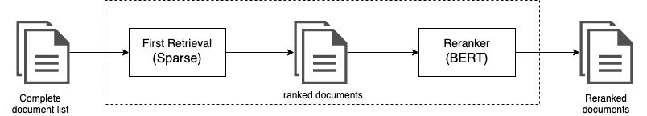

This project is conducted in collaboration between [LabIA](https://www.etalab.gouv.fr/datasciences-et-intelligence-artificielle) at Etalab [LabIA](https://www.etalab.gouv.fr/) and [Cedar](https://team.inria.fr/cedar/) team at Inria .
Other Lab IA projects can be found at the main GitHub repo. In particular, the repository for the [Piaf-ml](https://github.com/etalab-ia/piaf-ml) and [piaf annotator](https://github.com/etalab/piaf).


# Piaf-ranker

Piaf-ranker is a a French relevance judgment model that uses  [CamemBERT](https://arxiv.org/abs/1911.03894) as a base and scores a text passage based on its relevance to a certain query.
The model is utilized to re-rank documents In a multi-stage ranking approach. 

<p align="center">
      
</p>

## Model training 
The model is trained on french langauge data, using combination of three French Q&A datasets.
### Data
The three French Q&A datasets used are : 

- [piafv1.1](https://www.data.gouv.fr/en/datasets/piaf-le-dataset-francophone-de-questions-reponses/)
- [FQuADv1.0](https://fquad.illuin.tech/)
- [SQuAD-FR (SQuAD automatically translated to French)](https://github.com/Alikabbadj/French-SQuAD)

The model was trained on the positive passage associated with each question and the top 10 ranking document that do not conatain the answer. 


### Results 


|  | Recall@1 | MAP |
| ------ | ------ | ------ |
| BM25 | 0.63 | 0.71 |
| piaf-ranker |0.75 |0.80|


## Getting Started 
The necessay installations are the same as in [piaf-ml](https://github.com/etalab-ia/piaf-ml)
## Train the Model on your data
- Prepare your data in the form of a json file formated with the squad format. More information regarding the format of the file can be found [here](https://etalab-ia.github.io/knowledge-base/piaf/howtos/integrate.html#quel-format-pour-les-donnees)
- configure the dataset creation with dataset_creation_config.py
```python
parameters = {
    "k": 10,  # the number of negative passages to keep 
    "retriever_type": 'bm25',
    "squad_dataset": "data folder path",   
    "filter_level": None,
    "boosting": 1,
    "preprocessing": False, 
    "split_by": "word",  # Can be "word", "sentence", or "passage"
    "split_length": 512, #split_length of each document 
    "split_respect_sentence_boundary": True,
}
```
- Run the script in src/squad_to_Ranker.py it will generate three diffrent file train, dev and test csv
- Run the train script in src/train.py
- By the end of the training the model weights are saved in the model folder, statistics of the training (number of epochs , train_loss and validation_loss after each epoch , time of each training cycle ...)  are saved in the results folder.

### Evaluate performances for the stack PIAF 
To evaluate the model directly on the pretrained model
- Download the model weights file [here](https://drive.google.com/file/d/1ToGICur1OPmnU7j7G8HRisbPnkXOK_aA/view?usp=sharing)
- Prepare your knowledge base in the form of a json file formated with the squad format. More information regarding the format of the file can be found [here](https://etalab-ia.github.io/knowledge-base/piaf/howtos/integrate.html#quel-format-pour-les-donnees)
- Define the experiment parameters with src/config/test_config.py

``` python
parameters = {
    "k": 3, #the number of passages to retreive and run re-ranking on
    "model": 'model weights path',
    "complementary": False,
    "full" : False,
    "alpha": 0.5,
    "beta": 0.5,
}
```

